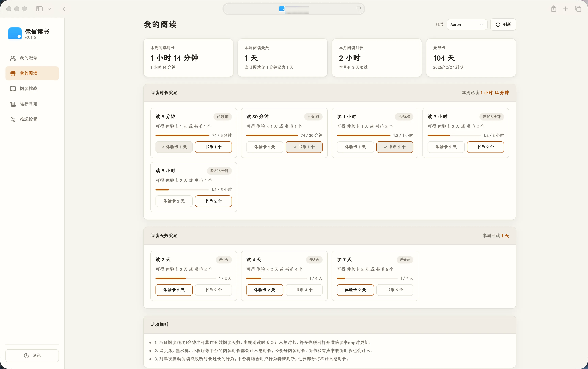
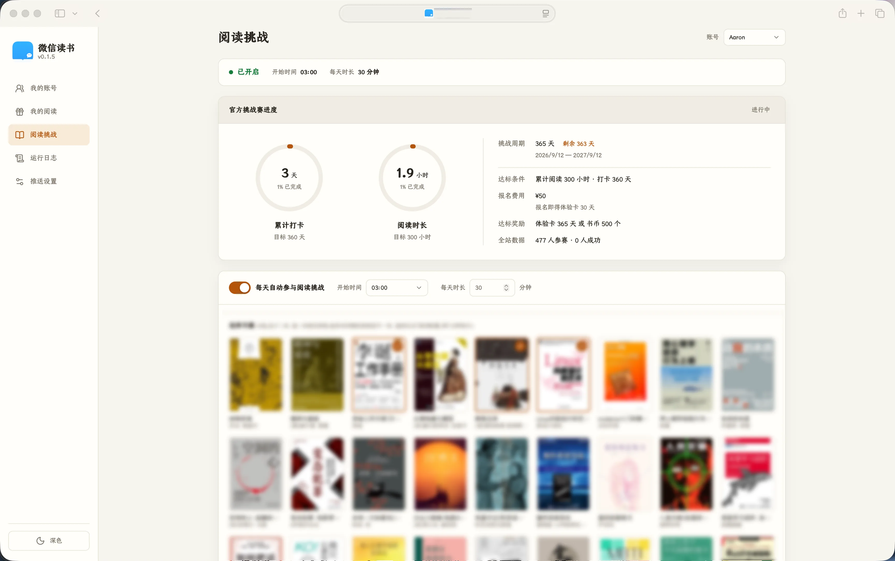

# WeRead-Kit

[](https://github.com/27Aaron/WeRead-Kit/releases) [](LICENSE)

## 界面预览

 

## 功能

- **自动完成阅读挑战**：每天按指定时间、时长和书单执行阅读任务；支持随机书单、手动立即执行和异常后续跑。
- **自动领取阅读奖励**：选择奖励档位和奖品后，程序会在奖励达成后自动领取同款奖励。
- **多渠道推送**：支持 Bark、Telegram、Server酱和 PushPlus，在阅读完成、中断或失败时通知你。
- **本地账号管理**：微信扫码登录，账号状态和配置保存在本机 SQLite 数据库中。
- **多用户**：支持同时管理多个微信读书账号，各账号的阅读挑战与奖励预约独立配置、互不影响。
- **登录密码保护**：设置账号密码后，Web 控制台需登录访问；登录会话 7 天有效，自带 CSRF 防护。
- **可观测的运行日志**：按账号和级别查看调度、登录续期、阅读上报和推送结果。
- **轻量 Web 控制台**：支持浅色/深色主题、响应式布局和可选登录保护。

## 快速开始

启动后浏览器打开 <http://127.0.0.1:8080>，账号数据默认写入当前目录的 `data/wxread.db`。

### Docker

```bash
docker run -d --name weread-kit \
  -p 8080:8080 \
  --stop-signal SIGINT \
  -e WXREAD_HOST=0.0.0.0 \
  -v wxread-data:/data \
  ghcr.io/27aaron/weread-kit:latest
```

> `--stop-signal SIGINT` 让容器停止时走应用的优雅退出路径，避免超时后被强杀。

仓库也自带 `compose.yaml`，克隆后直接 `docker compose up -d` 即可。

### 下载二进制

从 [Releases](https://github.com/27Aaron/WeRead-Kit/releases) 下载对应平台版本：

```bash
chmod +x weread-kit-<平台>
./weread-kit-<平台>
```

### Nix

如果你使用 Nix，可以直接运行或安装 flake 提供的程序：

```bash
# 不安装到系统，直接运行
nix run github:27Aaron/WeRead-Kit

# 安装到当前 profile
nix profile install github:27Aaron/WeRead-Kit
```

也可以将项目作为 flake input 引入你自己的 flake：

```nix
{
  inputs.wxread.url = "github:27Aaron/WeRead-Kit";
}
```

### 从源码运行

```bash
go run ./cmd/weread-kit
# 或
go build -o weread-kit ./cmd/weread-kit && ./weread-kit
```

需要 Go 1.26+；也可以使用仓库提供的 `nix develop` 环境进行开发。

## 推荐使用流程

1. **添加账号**：进入「我的账号」→「添加账户」→ 微信扫码确认。
2. **设置阅读挑战**：进入「阅读挑战」，选择至少一本书，设置每天开始时间和阅读时长，然后保存配置。
3. **打开自动执行**：开启「每天自动参与阅读挑战」。程序会按计划执行，异常退出后会在下次启动时继续未完成任务。
4. **预约奖励**：进入「我的阅读」，选择达成奖励后，后续每周会自动领取同款奖励。
5. **配置通知**：在「推送设置」填写渠道参数并发送测试消息。
6. **检查日志**：遇到异常时先按账号和级别筛选「运行日志」。

## 重要行为说明

- 阅读任务每 30 秒上报一次，页面会显示当前进度。
- 用户主动停止任务后，当天不会自动续跑；程序崩溃、重启或异常退出则会在下次启动时恢复。
- 会话过期时程序会自动尝试续期。持续失败时，在账号页刷新数据，必要时重新扫码。
- 数据默认保存在 `data/wxread.db`；备份时请同时备份整个 `data/` 目录，并建议先停止服务。

## 配置

复制 `.env.example` 为 `.env`，或直接设置环境变量：

| 变量 | 默认值 | 用途 |
| --- | --- | --- |
| `WXREAD_HOST` | `127.0.0.1` | 监听地址；容器中使用 `0.0.0.0` |
| `WXREAD_PORT` | `8080` | Web 端口 |
| `WXREAD_DB` | `data/wxread.db` | SQLite 数据库路径 |
| `WXREAD_USERNAME` | 空 | Web 登录账号；需与密码同时设置 |
| `WXREAD_PASSWORD` | 空 | Web 登录密码 |

## 开发

```bash
nix develop
go test ./...
go build ./...
gofmt -l .
```

## 更新记录

- [查看版本更新记录](CHANGELOG.md)

## 参考

- [findmover/wxread](https://github.com/findmover/wxread)
- [teng-lin/weread-omni](https://github.com/teng-lin/weread-omni)

## 免责声明

本项目仅供个人学习和研究。请遵守微信读书的用户协议，合理控制使用频率。因使用本项目产生的账号、数据或其他问题由使用者自行承担。